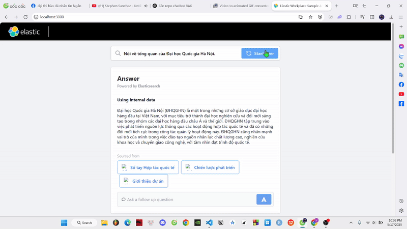

<div align="center">
        <h1>VNU-RAG-Chatbot</h1>
            <p>An AI-powered Q&A Chatbot about Vietnam National University</p>
            <p>
            <a href="https://github.com/zz4353/chatbot_rag_app/graphs/contributors">
                
            </a>
            <a href="">
                
            <a href="https://github.com/zz4353/chatbot_rag_app/network/members">
		        
	        </a>
	        <a href="https://github.com/zz4353/chatbot_rag_app/stargazers">
		        
	        </a>
</div>

# VNU RAG Chatbot App
This is an app that combines Elasticsearch, Langchain and a number of different LLMs (e.g., OpenAI, Ollama) to create a chatbot experience with ELSER with Vietnam National University data.



# Technology used
- Framework: Langchain
- Search engine + database: Elasticsearch
- Frontend:
    - HTML
    - SVG
    - JSON
    - React with TypeScript and JSX
    - TypeScript
    - CSS
    - JavaScript
- Backend:
    - Flask
    - Python

# How to run

## Init
- Copy [env.example](env.example) to `.env` and fill in values noted inside.
- Download all libraries in requirements.txt using ```pip install -r requirements.txt```
- Install Nodejs, yarn: https://nodejs.org/en
- Create an empty folder named `data_json`
- ```cd data``` and run ```python craw_data.py``` to craw data to `data_json` folder

### Configuring the LLM (Ollama with Gemma3)

1.  **Install and Run Ollama:**
    Ensure you have Ollama installed and the service is running on your machine. You can download it from [ollama.com](https://ollama.com/).

2.  **Pull the Gemma3 Model:**
    Open your terminal and run the following command to download the `gemma3` model:
    ```bash
    ollama pull gemma3
    ```

3.  **Set LLM Type in `.env` (for local non-Docker execution):**
    In your `.env` file (copied from `env.example`), ensure `LLM_TYPE` is set to `ollama`. If you are running Ollama on a different host or port, also set `OLLAMA_BASE_URL`.
    ```properties
    LLM_TYPE=ollama
    OLLAMA_BASE_URL=http://localhost:11434 # Default if Ollama runs locally
    # Other environment variables...
    ```

4.  **Update Model in Code:**
    Modify the file `api/llm_ollama.py` to use `gemma3` as the default model. Change the `model` parameter in the `stream` and `ask_ollama` functions:
    ```python
    # In api/llm_ollama.py

    # ...
    class OllamaResponse:
        # ...
        @staticmethod
        def stream(prompt, model="gemma3"): # Changed from "llama3" or other model
            # ... existing code ...

    def ask_ollama(question, model="gemma3"): # Changed from "llama3" or other model
        # ... existing code ...
    ```

**Note for Docker Users:**
If you are running the application using `docker-compose up --build`:
- The `LLM_TYPE` is already set to `ollama` in the `docker-compose.yml` and `Dockerfile`.
- Ensure Ollama is running on your **host machine**.
- Pull the `gemma3` model on your **host machine** using `ollama pull gemma3`.
- The application inside Docker will connect to Ollama on your host via `http://host.docker.internal:11434` (as configured in `docker-compose.yml`).
- You still need to make the code change in `api/llm_ollama.py` to use `gemma3` as shown in step 4 above. After making the change, rebuild your Docker image by running `docker-compose up --build`.

## Run app
- 1: cd frontend
    - npm install -g yarn
    - yarn install
- 2: Run
    - Terminal 1:
        - flask create-index (If you have already run this command, you do not need to run it again)
        - flask run --port=3001
    - Terminal 2:
        - cd frontend
        - yarn start

- The app will be available at https://localhost:3001